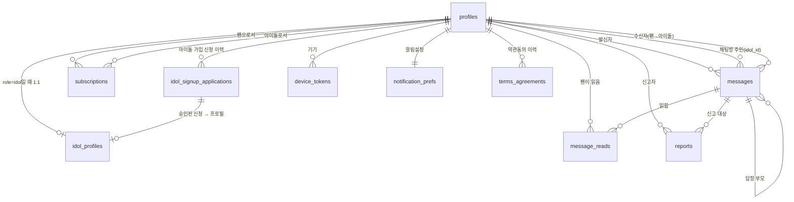

# DB 스키마

> 본 문서는 `gihagochi` 프로젝트의 Postgres 스키마 + RLS 정책의 **개요 / 참조 문서**.
> **진실의 원천은 [`backend/migrations/versions/0001_initial.py`](../backend/migrations/versions/0001_initial.py).** 본 문서와 마이그레이션이 충돌하면 마이그레이션이 우선.

**상태**: 초안 (Supabase dev 적용/검증 후 확정 예정).
**최초 작성**: 2026-05-16
**대상 DB**: Supabase Postgres

---

## 1. 개요

10개 public 테이블 + 9개 ENUM + 3개 RLS 헬퍼 함수 + 1개 broadcast 트리거.

| # | 테이블 | 한 줄 설명 | owner 피처 |
|---|---|---|---|
| 1 | `profiles` | 모든 사용자(팬/아이돌/관리자). `auth.users`와 1:1 | `auth` |
| 2 | `idol_signup_applications` | 아이돌 가입 신청 이력. 거절/재신청 추적 | `auth` / `admin` (공동) |
| 3 | `idol_profiles` | **활성** 아이돌 정보 (활동명/소개/썸네일) | `profile` |
| 4 | `subscriptions` | 팬→아이돌 응원 관계. soft cancel | `subscription` |
| 5 | `messages` | 모든 채팅 메시지. type으로 3종 분기 | `chat_message` |
| 6 | `message_reads` | 팬별 메시지 읽음 기록 | `chat_meta` |
| 7 | `reports` | 메시지 신고 + 관리자 처리 | `report` |
| 8 | `device_tokens` | FCM 토큰 (사용자당 N개) | `notification` |
| 9 | `notification_prefs` | 사용자별 알림 on/off | `notification` |
| 10 | `terms_agreements` | 약관/개인정보/마케팅 동의 이력 (버전별) | `auth` |

**owner 규칙**: 해당 피처 폴더가 이 테이블의 스키마 변경(컬럼 추가 등) 마이그레이션 작성을 담당.
다른 피처가 만지려면 owner와 사전 조율 (CODEOWNERS는 마이그레이션 폴더 자체를 메인 빌더가 게이트키핑).

---

## 2. ERD



---

## 3. ENUM 타입

| 이름 | 값 | 사용 위치 |
|---|---|---|
| `user_role` | `fan` / `idol` / `admin` | `profiles.role` |
| `user_status` | `pending` / `active` / `suspended` | `profiles.status` |
| `message_type` | `idol_to_fans` / `fan_to_idol` / `idol_reply` | `messages.type` |
| `media_type` | `text` / `photo` / `voice` | `messages.media_type` |
| `report_status` | `pending` / `handled` | `reports.status` |
| `report_action` | `dismissed` / `message_deleted` / `warned` / `suspended` | `reports.resolution_action` |
| `signup_application_status` | `pending` / `approved` / `rejected` / `withdrawn` | `idol_signup_applications.status` |
| `agreement_type` | `tos` / `privacy` / `marketing` | `terms_agreements.type` |
| `device_platform` | `ios` / `android` | `device_tokens.platform` |

---

## 4. 테이블 상세

각 테이블에 대해 컬럼 / 핵심 제약 / 인덱스 / 비고 순으로 정리.

### 4.1 `profiles`

모든 사용자의 공통 정보. `auth.users`와 1:1 (id가 동일).

| 컬럼 | 타입 | 기본/제약 | 설명 |
|---|---|---|---|
| `id` | uuid | PK, FK `auth.users(id)` ON DELETE CASCADE | Supabase Auth uid |
| `role` | `user_role` | NOT NULL, default `fan` | |
| `status` | `user_status` | NOT NULL, default `pending` | |
| `display_name` | text | NOT NULL | |
| `avatar_url` | text | | |
| `suspended_at` | timestamptz | | 정지 시점 (관리자 액션) |
| `suspend_reason` | text | | `suspended_at` 있을 때만 |
| `deleted_at` | timestamptz | | soft delete (탈퇴) |
| `created_at` / `updated_at` | timestamptz | NOT NULL, default NOW() | `updated_at`은 트리거 |

**제약**:
- `profiles_suspend_consistency`: `suspend_reason`은 `suspended_at` 있을 때만

**인덱스**:
- `idx_profiles_role_status (role, status) WHERE deleted_at IS NULL` — 관리자 대시보드

---

### 4.2 `idol_signup_applications`

아이돌 가입 신청 이력. 거절 후 재신청 가능.

| 컬럼 | 타입 | 기본/제약 | 설명 |
|---|---|---|---|
| `id` | uuid | PK, default `gen_random_uuid()` | |
| `user_id` | uuid | NOT NULL, FK `profiles(id)` ON DELETE RESTRICT | 신청자 |
| `stage_name` | text | NOT NULL | 신청 당시 활동명 |
| `bio` | text | | 신청 당시 소개 |
| `application_note` | text | | 추가 증빙/메모 |
| `status` | `signup_application_status` | NOT NULL, default `pending` | |
| `handled_by` | uuid | FK `profiles(id)` ON DELETE RESTRICT | 처리 관리자 |
| `handled_at` | timestamptz | | |
| `rejection_reason` | text | | rejected일 때 필수 |
| `created_at` / `updated_at` | timestamptz | NOT NULL, default NOW() | |

**제약**:
- `apps_handled_consistency`: pending이 아니면 `handled_by`+`handled_at` 모두 NOT NULL
- `apps_rejected_reason_required`: rejected면 `rejection_reason` NOT NULL

**인덱스**:
- `idx_idol_apps_one_pending_per_user (user_id) WHERE status='pending'` partial unique — 동시 pending 1건
- `idx_idol_apps_queue (status, created_at)` — 관리자 대기 큐 (F-035)

**라이프사이클**:
1. **신청** → INSERT (status='pending', `idol_profiles` row 없음)
2. **승인** → UPDATE (status='approved', handled_by/at 세팅) + `idol_profiles` row 생성 + `profiles.role`/`status` 업데이트 (트랜잭션)
3. **거절** → UPDATE (status='rejected', rejection_reason 기입). 재신청은 새 row INSERT.
4. **철회** → UPDATE (status='withdrawn')

---

### 4.3 `idol_profiles`

현재 활성 아이돌의 프로필. 거절된 신청 컬럼들은 여기에 없음 — `idol_signup_applications`에 분리.

| 컬럼 | 타입 | 기본/제약 | 설명 |
|---|---|---|---|
| `id` | uuid | PK, FK `profiles(id)` ON DELETE CASCADE | |
| `signup_application_id` | uuid | NOT NULL, FK `idol_signup_applications(id)` ON DELETE RESTRICT | 어느 신청으로 활성화됐는지 |
| `stage_name` | text | NOT NULL, UNIQUE | 활동명 (중복 불가) |
| `bio` | text | | |
| `thumbnail_url` | text | | |
| `activated_at` | timestamptz | NOT NULL, default NOW() | 활성화 시점 |
| `created_at` / `updated_at` | timestamptz | NOT NULL, default NOW() | |

**인덱스**:
- `idx_idol_profiles_activated_at (activated_at DESC)` — F-008 탐색 리스트 (정렬 기준은 추후 확정)

---

### 4.4 `subscriptions`

팬→아이돌 응원 관계. PK가 `(fan_id, idol_id)` 복합 → 재구독은 같은 row의 UPDATE.

| 컬럼 | 타입 | 기본/제약 | 설명 |
|---|---|---|---|
| `fan_id` | uuid | PK, FK `profiles(id)` ON DELETE CASCADE | |
| `idol_id` | uuid | PK, FK `profiles(id)` ON DELETE CASCADE | |
| `subscribed_at` | timestamptz | NOT NULL, default NOW() | 첫 구독 시점 (재구독 시 갱신 X) |
| `unsubscribed_at` | timestamptz | | NULL이면 활성 |
| `last_read_at` | timestamptz | NOT NULL, default NOW() | 미읽음 카운트 캐시 |

**제약**: `subs_no_self` — `fan_id <> idol_id`

**인덱스**:
- `idx_subscriptions_active_by_fan (fan_id) WHERE unsubscribed_at IS NULL` — F-007 팬 메인
- `idx_subscriptions_active_by_idol (idol_id) WHERE unsubscribed_at IS NULL` — F-011 아이돌 상세 (팬 수)

**재구독 흐름**:
- 응원 취소: `UPDATE ... SET unsubscribed_at = NOW()`
- 재구독: `UPDATE ... SET unsubscribed_at = NULL, last_read_at = NOW()` (같은 row 재활성화)
- → RLS가 자동으로 메시지 가시성 복원. `message_reads`도 그대로 보존되어 읽음 상태 유지.

---

### 4.5 `messages`

모든 채팅 메시지를 단일 테이블 + `type` 분기로 관리.

| 컬럼 | 타입 | 기본/제약 | 설명 |
|---|---|---|---|
| `id` | uuid | PK, default `gen_random_uuid()` | |
| `client_message_id` | uuid | | idempotency (앱 생성 UUID) |
| `type` | `message_type` | NOT NULL | |
| `sender_id` | uuid | NOT NULL, FK `profiles(id)` ON DELETE RESTRICT | |
| `idol_id` | uuid | NOT NULL, FK `profiles(id)` ON DELETE RESTRICT | 채팅방 주인 |
| `recipient_id` | uuid | FK `profiles(id)` ON DELETE RESTRICT | `fan_to_idol`일 때 |
| `parent_message_id` | uuid | FK `messages(id)` ON DELETE SET NULL | `idol_reply`일 때 |
| `content` | text | | text 메시지 본문 |
| `media_type` | `media_type` | NOT NULL, default `text` | |
| `media_url` | text | | photo/voice일 때 |
| `created_at` | timestamptz | NOT NULL, default NOW() | |
| `edited_at` | timestamptz | | |
| `deleted_at` | timestamptz | | soft delete |

**제약**:
- `messages_type_consistency` — type별 recipient/parent 조합:
  - `idol_to_fans` → recipient_id IS NULL, parent_message_id IS NULL
  - `fan_to_idol` → recipient_id = idol_id, parent_message_id IS NULL
  - `idol_reply` → recipient_id IS NULL, parent_message_id IS NOT NULL
- `messages_media_consistency` — media_type별 url/content 조합:
  - `text` → media_url IS NULL, content IS NOT NULL
  - `photo|voice` → media_url IS NOT NULL

**인덱스**:
- `idx_messages_room_history (idol_id, created_at DESC) WHERE deleted_at IS NULL` — **핵심**: F-022 채팅방 페이지네이션
- `idx_messages_fan_to_idol (recipient_id, created_at DESC) WHERE type='fan_to_idol' AND deleted_at IS NULL` — F-024 아이돌 메인
- `idx_messages_parent (parent_message_id) WHERE parent_message_id IS NOT NULL` — F-023 답장
- `idx_messages_idempotency (sender_id, client_message_id) WHERE client_message_id IS NOT NULL` partial unique — 중복 INSERT 차단

**트리거**:
- `tg_messages_broadcast`: INSERT/UPDATE/DELETE 시 `realtime.broadcast_changes`로 `idol:<idol_id>` 토픽 push (F-018, F-023, F-025, F-026 실시간 반영)

---

### 4.6 `message_reads`

팬별 메시지 읽음 기록. F-021 통계 및 분석용.

| 컬럼 | 타입 | 기본/제약 | 설명 |
|---|---|---|---|
| `message_id` | uuid | PK, FK `messages(id)` ON DELETE CASCADE | |
| `fan_id` | uuid | PK, FK `profiles(id)` ON DELETE CASCADE | |
| `read_at` | timestamptz | NOT NULL, default NOW() | |

**인덱스**: `idx_message_reads_by_fan (fan_id, read_at DESC)`

**미읽음 카운트와의 관계**:
- 빠른 미읽음 카운트는 `subscriptions.last_read_at` 사용 (range scan 인덱스).
- `message_reads`는 정확한 메시지별 통계용 (이 메시지를 누가 읽었나).

---

### 4.7 `reports`

신고 + 관리자 처리. status와 resolution_action을 분리.

| 컬럼 | 타입 | 기본/제약 | 설명 |
|---|---|---|---|
| `id` | uuid | PK, default `gen_random_uuid()` | |
| `reporter_id` | uuid | NOT NULL, FK `profiles(id)` ON DELETE RESTRICT | |
| `message_id` | uuid | NOT NULL, FK `messages(id)` ON DELETE RESTRICT | |
| `reason` | text | NOT NULL | |
| `status` | `report_status` | NOT NULL, default `pending` | 워크플로 상태 |
| `resolution_action` | `report_action` | | handled일 때 NOT NULL |
| `resolution_note` | text | | 관리자 메모 |
| `handled_by` | uuid | FK `profiles(id)` ON DELETE RESTRICT | |
| `handled_at` | timestamptz | | |
| `created_at` | timestamptz | NOT NULL, default NOW() | |

**제약**:
- `reports_handled_consistency` — status='handled'이면 resolution_action/handled_by/handled_at 모두 NOT NULL
- `reports_no_duplicate UNIQUE (message_id, reporter_id)` — 같은 사람이 같은 메시지 중복 신고 X

**인덱스**:
- `idx_reports_queue (status, created_at) WHERE status='pending'` — F-037 관리자 대기 큐
- `idx_reports_by_message (message_id)` — 메시지별 신고 수 집계

**경고 누적은 reports 집계로**: `WHERE resolution_action='warned' AND <대상 user>` 식으로 카운트. 자동 정지 정책 도입 시 `user_warnings` 별도 테이블로 승격 검토.

---

### 4.8 `device_tokens`

FCM 토큰. 사용자당 N개 (멀티 디바이스).

| 컬럼 | 타입 | 기본/제약 | 설명 |
|---|---|---|---|
| `id` | uuid | PK, default `gen_random_uuid()` | |
| `user_id` | uuid | NOT NULL, FK `profiles(id)` ON DELETE CASCADE | |
| `platform` | `device_platform` | NOT NULL | |
| `token` | text | NOT NULL, UNIQUE | FCM 토큰 |
| `created_at` / `last_used_at` | timestamptz | NOT NULL, default NOW() | |

**인덱스**: `idx_device_tokens_by_user (user_id)` — 푸시 발송 시 토큰 조회

---

### 4.9 `notification_prefs`

사용자별 알림 on/off. 1:1 with profiles.

| 컬럼 | 타입 | 기본/제약 | 설명 |
|---|---|---|---|
| `user_id` | uuid | PK, FK `profiles(id)` ON DELETE CASCADE | |
| `new_message_enabled` | bool | NOT NULL, default TRUE | |
| `idol_reply_enabled` | bool | NOT NULL, default TRUE | |
| `marketing_enabled` | bool | NOT NULL, default FALSE | |
| `updated_at` | timestamptz | NOT NULL, default NOW() | 트리거 갱신 |

---

### 4.10 `terms_agreements`

약관/개인정보/마케팅 동의 이력. 버전별로 보존.

| 컬럼 | 타입 | 기본/제약 | 설명 |
|---|---|---|---|
| `id` | uuid | PK, default `gen_random_uuid()` | |
| `user_id` | uuid | NOT NULL, FK `profiles(id)` ON DELETE RESTRICT | |
| `type` | `agreement_type` | NOT NULL | |
| `version` | text | NOT NULL | 약관 버전 |
| `agreed_at` | timestamptz | NOT NULL, default NOW() | |

**제약**: `terms_agreements_no_duplicate UNIQUE (user_id, type, version)` — 같은 버전 중복 동의 방지

**불변성**: UPDATE/DELETE RLS 정책 자체를 안 만듦 → 기본 deny. 법적 보존.

---

## 5. RLS 정책 요약

모든 테이블에 RLS 활성화. 정책은 [`0001_initial.py`](../backend/migrations/versions/0001_initial.py) §15~22 참조.

### 헬퍼 함수
- `is_admin()` — 현재 사용자가 활성 관리자인지
- `is_active_idol(uuid)` — 인자가 활성 아이돌인지
- `is_subscribed_to(uuid)` — 현재 사용자가 해당 아이돌을 응원 중인지

모두 `SECURITY DEFINER`로 RLS 재귀 회피.

### 테이블별 정책 요약

| 테이블 | SELECT | INSERT | UPDATE | DELETE |
|---|---|---|---|---|
| `profiles` | 본인 + 관리자 + (다른 사용자의 non-deleted) | 본인만 | 본인 / 관리자 | 관리자만 |
| `idol_signup_applications` | 본인 + 관리자 | 본인 (pending만) | 본인은 pending→withdrawn만 / 관리자는 자유 | 관리자만 |
| `idol_profiles` | 모두 (공개) | 관리자만 | 본인 / 관리자 | 관리자만 |
| `subscriptions` | 본인(팬/아이돌 모두) + 관리자 | 본인 (활성 아이돌에만) | 본인 | 본인 + 관리자 |
| `messages` | 본인 발신 / 응원중 브로드캐스트 / 자기방 fan 메시지 / 관리자 | type별 분리 정책 (§아래) | 본인 / 관리자 | 관리자만 |
| `message_reads` | 본인 + 해당 메시지의 아이돌 + 관리자 | 본인 (응원 중 아이돌 메시지만) | — | 본인 + 관리자 |
| `reports` | 본인 + 관리자 | 본인 (pending만) | 관리자만 | 관리자만 |
| `device_tokens` | 본인 + 관리자 | 본인 | 본인 | 본인 + 관리자 |
| `notification_prefs` | 본인 + 관리자 | 본인 | 본인 | 관리자만 |
| `terms_agreements` | 본인 + 관리자 | 본인 | — (불변) | — (불변) |

### `messages` INSERT 정책 (가장 복잡)

- **아이돌 발행** (`idol_to_fans`/`idol_reply`):
  - `sender_id = auth.uid() AND idol_id = auth.uid()`
  - `is_active_idol(auth.uid())`
  - `idol_reply`면 `parent_message_id`가 본인 채팅방의 `fan_to_idol` 메시지여야 함
- **팬 발신** (`fan_to_idol`):
  - `sender_id = auth.uid()`
  - `recipient_id = idol_id`
  - `is_subscribed_to(idol_id)` — 응원 중인 아이돌에만

### `profiles` SELECT — 현재의 트레이드오프

현재 정책은 인증된 모든 사용자가 active+non-deleted profiles를 조회 가능. `suspend_reason` 같은 민감 컬럼은 **서비스 레이어가 가림** (API에서 안 내보냄).

**Future work**: `profiles_public` view를 만들어 공개 컬럼만 노출 + 본 테이블 RLS를 본인+관리자로 좁힘. 채팅 피처 작업 직전(또는 작업 중) 승격 권장.

---

## 6. 핵심 설계 결정

자세한 사유는 메인 빌더 작업 노트(`_workspace/schema/notes.md`, gitignored). 요약만:

### 6.1 단일 `messages` 테이블 + type 분기
`idol_to_fans` / `fan_to_idol` / `idol_reply`를 모두 한 테이블에. fan-out broadcast가 한 트리거로 끝남. 채팅방 히스토리 쿼리도 단일 인덱스로 끝남.

### 6.2 `idol_id`를 모든 메시지에 비정규화
`idol_reply`도 `idol_id`를 들고 있어야 RLS가 1단계 조회로 끝남. 없으면 parent 따라가서 RLS 재귀화.

### 6.3 `subscriptions` 복합 PK `(fan_id, idol_id)`
재구독을 UPSERT 패턴으로 자연스럽게. 같은 row를 `unsubscribed_at = NULL`로 재활성화 → RLS가 자동으로 메시지 가시성 복원.

### 6.4 `idol_signup_applications` 별도 테이블
거절/재신청 이력 보존. `idol_profiles`는 현재 활성 아이돌 정보만 유지 (rejection_reason 같은 죽은 컬럼 안 섞임).

### 6.5 `terms_agreements` 별도 테이블
`profiles`에 컬럼으로 합치지 않음. 약관 버전 업데이트 시 재동의 이력 보존 (개인정보보호법).

### 6.6 `subscriptions.last_read_at` (미읽음 카운트 캐시)
팬 메인의 N개 채팅방 × 미읽음 뱃지 N+1 방지. `message_reads`와 공존: 빠른 카운트 + 정확한 추적.

### 6.7 `messages.client_message_id` (idempotency)
앱이 발송 전 생성한 UUID로 네트워크 재시도 시 중복 INSERT 차단. `(sender_id, client_message_id)` partial unique.

### 6.8 `reports.status` + `resolution_action` 분리
워크플로 상태(pending/handled)와 실제 액션(dismissed/message_deleted/warned/suspended)을 차원 분리. 통계/정책 추가 시 유연.

### 6.9 soft delete 일관
`profiles.deleted_at`, `subscriptions.unsubscribed_at`, `messages.deleted_at`. F-013 / F-026 / F-032 정책이 바뀌어도 RLS 조건만 손보면 됨.

### 6.10 FK ON DELETE — RESTRICT 우선
`messages`/`reports`/`terms_agreements` 등 감사/법적 데이터는 RESTRICT (보존). `subscriptions`/`device_tokens` 등 사용자 종속 데이터만 CASCADE. 하드 삭제는 service 레이어에서 명시적 anonymization 후.

---

## 7. TBD / Future Work

| ID | 사항 | 결정 시점 / 영향 |
|---|---|---|
| F-001 | 소셜 로그인 | `auth.users`가 처리 → 스키마 영향 X |
| F-013 | 응원 취소 후 메시지 보존 | **결정됨**: 재구독 시 자동 복원 (§6.3) |
| F-021 | 읽음 통계 형태 | 집계 view 또는 API 응답 형태 결정 시 |
| F-030 | 아이돌 프로필 편집 승인 | `idol_profile_change_requests` 별도 테이블 추가 |
| F-032 | 탈퇴 정책 | 스키마는 soft delete 지원. hard delete API만 추가 |
| F-034 | 약관 문안 | `terms_agreements.version` 값만 결정 |
| F-010 | 필터 항목 | `idol_categories` / `idol_tags` 또는 `idol_profiles` 컬럼 |
| F-009 | 검색 성능 | 아이돌 수 증가 시 `pg_trgm` + GIN |
| — | `profiles_public` view (보안 강화) | 채팅 피처 작업 직전 |
| — | `user_warnings` 테이블 | 경고 누적 자동 정지 정책 도입 시 |

---

## 8. 변경 가이드 (피처 작업자용)

### 8.1 한 컬럼 추가하기

1. **owner 확인**: §1 표에서 해당 테이블 owner 피처 확인. 본인 피처면 OK. 아니면 owner와 사전 조율.
2. **마이그레이션 생성**:
   ```powershell
   cd backend
   alembic revision -m "add <column_name> to <table>"
   ```
3. **새 파일에 작성**:
   ```python
   def upgrade() -> None:
       op.execute("ALTER TABLE <table> ADD COLUMN <name> <type>;")
       # RLS / CHECK / 인덱스도 필요하면 같이
   def downgrade() -> None:
       op.execute("ALTER TABLE <table> DROP COLUMN <name>;")
   ```
4. **dev 적용 + 검증** → PR.

### 8.2 새 테이블 추가하기

- 본인 피처가 owner이고 `core/`/`shared/`에 영향 없으면 자체 마이그레이션으로.
- 다른 피처가 join할 가능성 있으면 메인 빌더에게 핑 → `shared/models/` 합의 후 진행.

### 8.3 RLS 정책 추가 / 변경

- 새 테이블엔 반드시 RLS 활성화 + 정책 작성. 기본 deny가 위험.
- 헬퍼 함수(`is_admin`, `is_active_idol`, `is_subscribed_to`) 재사용 권장.
- 변경 사유는 PR description에. 1차 review는 메인 빌더.

### 8.4 마이그레이션 충돌

- 두 PR이 같은 `0002_*.py`로 충돌하면 늦은 쪽이 `alembic merge`로 합침.
- migrations 폴더는 CODEOWNERS 게이트키핑 → 메인 빌더가 최종 검토.

---

## 9. 검증 쿼리 (적용 후 Studio에서 실행)

```sql
-- 10개 테이블 + RLS 활성화 확인
SELECT tablename, rowsecurity FROM pg_tables
  WHERE schemaname = 'public' ORDER BY tablename;

-- 9개 ENUM 확인
SELECT typname FROM pg_type WHERE typtype = 'e' ORDER BY typname;

-- 헬퍼 함수 3개
SELECT proname FROM pg_proc
  WHERE pronamespace = 'public'::regnamespace
    AND proname IN ('is_admin', 'is_active_idol', 'is_subscribed_to');

-- 정책 수 (테이블별)
SELECT tablename, COUNT(*) FROM pg_policies
  WHERE schemaname = 'public' GROUP BY tablename ORDER BY tablename;

-- broadcast 트리거
SELECT tgname, tgrelid::regclass FROM pg_trigger
  WHERE tgname = 'tg_messages_broadcast';
```

기능 시나리오:
- 팬 가입 → 약관 동의 row 생성 → 응원 → 메시지 수신
- 아이돌 신청 → 관리자 승인 → idol_profiles 생성
- 응원 안 한 아이돌 메시지 SELECT → 0 rows
- 응원 취소 → 메시지 안 보임 → 재구독 → 다시 보임

---

## END
